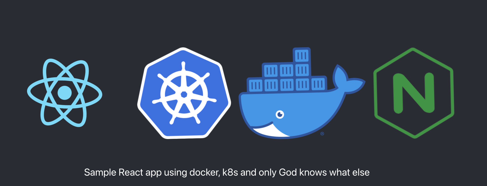

  

# Personal playground for containers and worklofws

The purpose of this app is to run only 🏃‍♂️

## Inscription

First of all, I need to thank to my friend, unvoluntary mentor and the greatest CTO of all times [Juffalow](https://github.com/juffalow) for starting all this mess in my head. Thank you, stay awesome! 🥳
*Don't forget to visit him and give him some ⭐️.*

## Let's start

### What we need?

- Installed `node` and `npm`
- Docker desktop app
- High amount of motivation and patience

### Install

1. Clone Repository
2. run `npm install` in backend and frontend
3. make sure your docker desktop is running
4. fill in docker credentials either in your repo secrets or in workflows env
5. run `docker-compose up` in the root
6. app should be running
7. Play with setup
